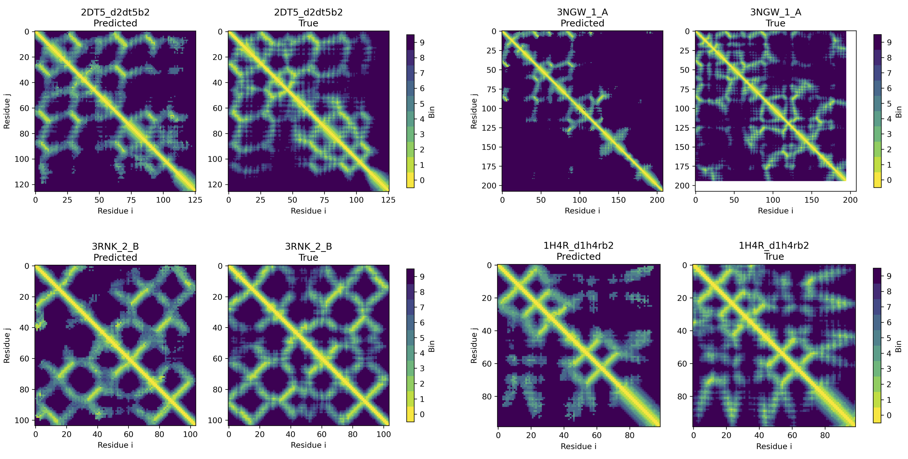

# Protein folding

Small scale model based on [AlphaFold](https://github.com/deepmind/deepmind-research/tree/master/alphafold_casp13) for protein alpha-carbon distrogram prediction. 
Inputs are MSA co-evolution data from [ProteinNet](https://github.com/aqlaboratory/proteinnet).  

## Usage
|File|Description|
|---|---|
|subset_data.py|Reads ProteinNet text files and extracts subset of records, filters based on total length of protein and saves arrays of PSSM and coordinate data for each sample to numpy .npy files for individual loading.|
|proteinnet_eda.ipynb|Notebook for exploratory data analysis of the ProteinNet dataset examining average length and total number of samples.|
|utils.py|Utility file containing functions to read model hyperparameters from an input YAML file, checkpoint handling, and contact precision calculation by selecting a region of the distrogram to evaluate.|
|dataset.py|PyTorch dataset to carry out the featurization step generating the binned pairwise distance matrix from backbone atom coordinates and stacking of co-evolution PSSM/information content data in the channel dimension for each residue pair.|
|model.py|PyTorch model defining the architecture of the deep residual convolutional network. The complete ResNet is composed of repeated ResBlocks with cycling dilation values.|
|train.py|Model training script that reads hyperparameters from YAML input, sets up dataloader, logs training and validation progress (accuracy and losses at end of each epoch), and saves model checkpoints for evaluation on the test set.|
|test.py|Evaluate model performance on the test set and output contact precision statistics summarizing classification accuracy, precision at short, medium, and long sequence distance.|

### Running

1. Parse ProteinNet text records with `subset_data.py`, select protein max residue length and number of records to save.
2. Edit input hyperparameters for bin assignments and model depth, example file at `/configs/block_10_config.yaml`. `n_blocks` sets how many groups of ResBlocks.
3. Train with `python train.py -c <input_config>`.
4. Evaluate on test and get contact precision statistics with `python test.py -c <input_config>`.

## Example outputs

Distances are binned into 10 categories with exclusive right boundary. 

|Bin|Distance (Å)|
|---|---|
|0|0 - 4| 
|1|4 - 6|
|2|6 - 8|
|3|8 - 10|
|4|10 - 12|
|5|12 - 14|
|6|14 - 16|
|7|16 - 18|
|8|18 - 20|
|9|20+|

Distrogram predictions from a minimally trained model.
White portions in the true distrogram are disordered regions not captured in experiment, and ignored in loss calculations. 

